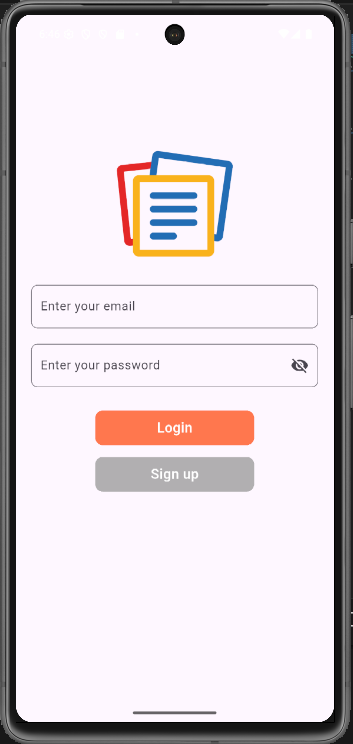
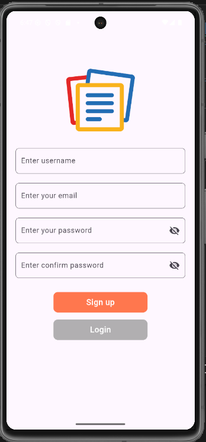
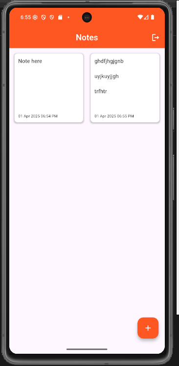
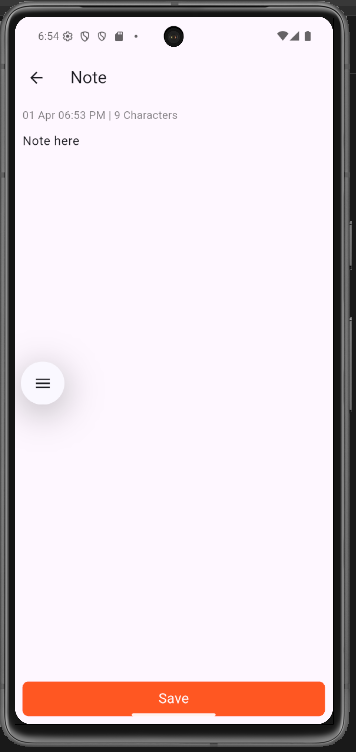

# 📒 Notes App

A **cloud-based notes application** built using **Flutter** that allows users to **create**, **update**, and **delete** notes securely from anywhere in the world. Users can access their notes seamlessly by simply logging into the app using their email and password.

This project is built with a strong foundation using **Flutter Clean Architecture**, ensuring **scalability**, **maintainability**, and **testability** of the codebase.

---

## ✨ Features

- 🔐 **User Authentication**
  - Secure login and signup using **Firebase Authentication**.
- ☁️ **Cloud Storage**
  - Notes are stored online using **Cloud Firestore**, allowing real-time syncing.
- 📝 **Notes Management**
  - Easily create, edit, delete, and view your notes from anywhere.
- 🧱 **Clean Architecture**
  - Designed with separation of concerns in mind:
    - `core`: Common utilities and models
    - `features`: Domain, data, and presentation layers
    - `shared`: Reusable components
- 📱 **Responsive UI**
  - Clean and user-friendly interface optimized for multiple screen sizes.

---

## 🛠 Tech Stack

- **Flutter** – UI toolkit for building natively compiled apps
- **Firebase Authentication** – Secure and easy sign-in methods
- **Cloud Firestore** – NoSQL cloud database for storing and syncing data
- **Provider** – State management
- **Flutter Clean Architecture** – For modular, testable, and maintainable code

---

## 📸 Screenshots

<!-- Screenshots are located in assets/snapshots/ -->

<div align="center">

<table>
  <tr>
    <td>
      
    </td>
    <td>
      
    </td>
  </tr>
  <tr>
    <td align="center">🔐 Login Screen</td>
    <td align="center">📝 Signup Screen</td>
  </tr>
  <tr>
    <td>
      
    </td>
    <td>
      
    </td>
  </tr>
  <tr>
    <td align="center">📄 Notes List</td>
    <td align="center">🖊️ Edit Note</td>
  </tr>
</table>

</div>

---

## 🚀 Getting Started

To run this app locally:

### 1. Clone the repository
```bash
git clone https://github.com/your-username/notes_app.git
cd notes_app

